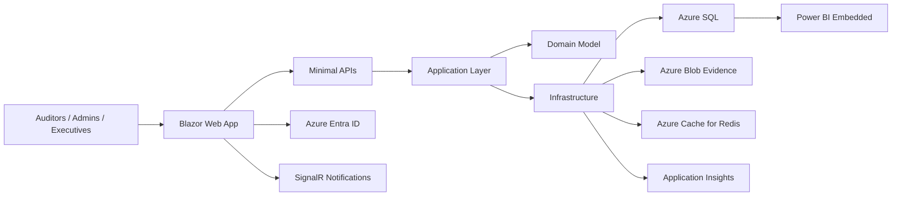
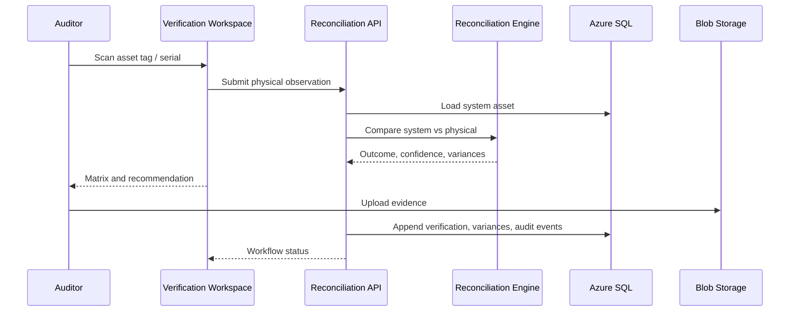

# Solution Architecture

## Platform Overview

The system is organized as a Clean Architecture Blazor Web App with a SQL Server transactional core and Azure-native platform services.

## Layers

### Presentation Layer

`InventoryReconciliation.Web`

- Blazor Web App with interactive server rendering.
- MudBlazor UI components and Fluent UI component services.
- Pages for dashboard, upload, asset explorer, field verification, reconciliation, timeline, analytics, reports, approvals, roles, settings, notifications, and mobile PWA flow.
- Minimal APIs expose import preview, reconciliation preview, and asset query endpoints.

### Application Layer

`InventoryReconciliation.Application`

- DTOs and contracts for asset, import, dashboard, and reconciliation workflows.
- `ReconciliationEngine` scores physical observations against master data.
- `InventoryImportValidator` suggests dynamic mappings and validates mandatory columns.
- Interfaces for repositories, unit of work, Excel reader, attachment storage, and current user context.

### Domain Layer

`InventoryReconciliation.Domain`

- Core aggregate entities: `Asset`, `AssetVerification`, `ReconciliationVariance`, `AssetAuditLog`, `InventoryImportBatch`, `InventorySnapshot`.
- Immutable audit log model: changes are appended rather than overwriting history.
- Value objects for locations and physical observations.

### Infrastructure Layer

`InventoryReconciliation.Infrastructure`

- EF Core SQL Server `AppDbContext`.
- SQL indexes designed for 100k+ asset filtering/search and dashboard aggregation.
- ClosedXML-based workbook profiling for `.xlsx` import preview.
- Azure Blob attachment store for evidence images, voice notes, and supporting documents.
- Redis cache registration when configured.

## Reconciliation Flow

## Reconciliation Outcomes

- `ExactMatch`: No material differences, auto-close candidate.
- `PartialMatch`: Non-critical mismatch such as location or department change.
- `CriticalMismatch`: High-risk mismatch such as serial mismatch, inactive asset found, or sticker missing.
- `MissingAsset`: Active asset not physically located.
- `UnauthorizedAsset`: Physical asset not found in master inventory.
- `DuplicateCandidate`: Asset tag or serial requires merge/review workflow.

## Import Architecture

1. Upload `.xlsx`.
2. Stream workbook into preview reader.
3. Profile headers, non-blank counts, unique counts, formula errors, and samples.
4. Suggest target field mapping from known aliases.
5. Detect missing mandatory mappings and duplicate asset tags.
6. User reviews preview.
7. Import creates `InventoryImportBatch`.
8. Commit creates immutable `InventorySnapshot`.
9. Asset changes append `AssetAuditLog` events with previous and new values.

## Performance Strategy

- Server-side pagination and filtering.
- Normalized asset tag and serial indexes.
- Department/location/status indexes for dashboard and reports.
- Redis cache for executive dashboard aggregates.
- SQL query retry and command timeout policies.
- Bulk import design separated from interactive verification.
- Blob storage for large attachments; SQL stores metadata only.

## Future Production Enhancements

- Background import jobs using Azure WebJobs or Hangfire.
- Full Power BI Embedded workspace integration.
- OCR/barcode scanner JavaScript bridge.
- PWA offline queue with encrypted IndexedDB.
- AI anomaly service for duplicate detection and unusual movement patterns.
- SCIM/group sync from Azure Entra ID.
